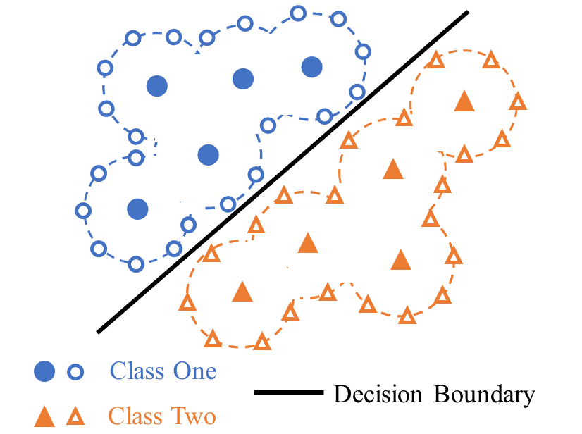

# IbM2

This repo is the official implementation of our CVPR2024 paper "Instance-based Max-margin for Practical Few-shot Recognition" ([arXiv](https://arxiv.org/abs/2305.17368)). 

<h3>TL;DR</h3>

This paper proposes:
* A practical FSL (pFSL) setting based on unsupervised pretrained models and recognizes many novel classes simultaneously. 
* IbM2, an instance-based max-margin methd based on the *Gaussian Annulus Theorem*. IbM2 converts random noise applied to the instances into a mechanism to achieve maximum margin.



---


## Environment


- python 3.8
- pytorch >= 1.7
- torchvision >= 0.8
- timm 0.4.9


## Data Preparation

### 1. Datasets

### ImageNet

The ImageNet dataset is a large-scale image dataset widely used for various computer vision tasks.

##### Download

1. Register and download the dataset from the [official ImageNet website](http://www.image-net.org/).
2. Follow the instructions to download the ILSVRC2012 dataset, which includes training and validation images.

##### Structure

After downloading, organize the dataset into the following directory structure:

```angular2html
/path/to/imagenet/
train/
n01440764/
n01440764_18.JPEG
...
...
val/
n01440764/
ILSVRC2012_val_00000293.JPEG
...
...
```
- For 1%-ImageNet variant, please refer to [imagenet_subsets](https://www.tensorflow.org/datasets/catalog/imagenet2012_subset) and [build_imagenet_subsets](https://github.com/tensorflow/datasets/blob/master/tensorflow_datasets/datasets/imagenet2012_subset/imagenet2012_subset_dataset_builder.py) for more details. Or for convinence, you can directly download the training set from this [link](https://huggingface.co/datasets/heekhero/imagenet_1pct/tree/main).

### CUB-200-2011

The CUB-200-2011 (Caltech-UCSD Birds-200-2011) dataset is a widely used dataset for fine-grained visual categorization tasks, specifically bird species classification.

##### Download

1. Download the dataset from the [official CUB-200-2011 website](http://www.vision.caltech.edu/datasets/cub_200_2011/).
2. Extract the downloaded tar file.

##### Structure

After extracting, organize the dataset into the following directory structure:

```angular2html
/path/to/cub_200_2011/
images/
001.Black_footed_Albatross/
Black_Footed_Albatross_0001_796111.jpg
...
...
train_test_split.txt
```

Use the script [datasets/cub_preprocess.py](datasets/cub_preprocess.py) to organize the **images** folder into **train** and **test** folders. After running the script, you will have two additional folders named **train** and **test** in your root directory.

### 2. Feature Extraction

IbM2 is a method for directly interacting with features extracted by backbones. To facilitate the evaluation process, you can preliminarily store the features using the provided scripts: [extract_features.py](extract_features.py) and [extract_features_imagenet_1pt.py](extract_features_imagenet_1pt.py). 
```angular2html
python extract_features.py
```
Parameters:
* dataset - choices: Imagenet or CUB.
* shot - choices: 1, 2, 3, 4, 5, 8, 16.
* save_test: whether to save the features for testing.
* arch: model architecture - choice: deit_small_p16, deit_large_p7, deit_base_p4, resnet50
* batch_size: batch size to extract the features
* pretrain_method: unsupervised pretraining method - choice: DINO, MSN, MoCov3, SimCLR, BYOL.

or
```angular2html
python extract_features_imagenet_1pt.py
```
Note: **Before that**, you should download the

1. **few-shot annotations** (few_shot_split folder) ([link](https://huggingface.co/heekhero/IbM2_model_and_features/blob/main/few_shot_split.tar.gz))
2. backbone checkpoints (refer to table below)
3. correctly set the path in [config.py](config.py).

The template of config.py looks like:
* **IMAGENET_PATH**: root path of imagenet dataset
* **CUB_PATH**: root path of CUB dataset
* **IMAGENET_1PT_PATH**: root path of 1%-imagnet dataset
* **SPLIT_PATH**: path of few-shot annotations files (/path/to/few_shot_split)


We experiment our IbM2 with various unsupervised pretraining method pretrained on ImageNet-1K. We provide the backbone checkpoints and the correponding extracted features to reproduce our results:

| Method | Architecture | Checkpoint | ImageNet Features | CUB Features | 1-pct Features | 
|---|---|---|---|---|---|
| DINO | ViT-S/16 | [backbone](https://huggingface.co/heekhero/IbM2_model_and_features/blob/main/DINO/dino_deitsmall16_pretrain.pth) | [imagenet features](https://huggingface.co/heekhero/IbM2_model_and_features/tree/main/DINO/Imagenet/deit_small_p16/features) | [CUB features](https://huggingface.co/heekhero/IbM2_model_and_features/tree/main/DINO/CUB/deit_small_p16/features) | [1%-imagenet features](https://huggingface.co/heekhero/IbM2_model_and_features/tree/main/DINO/Imagenet_1pt/deit_small_p16/features) |
| MoCov3 | ViT-S/16 | [backbone](https://huggingface.co/heekhero/IbM2_model_and_features/blob/main/MoCov3/vit-s-300ep.pth.tar) | [imagenet features](https://huggingface.co/heekhero/IbM2_model_and_features/tree/main/MoCov3/Imagenet/deit_small_p16/features) | - | [1%-imagenet features](https://huggingface.co/heekhero/IbM2_model_and_features/tree/main/MoCov3/Imagenet_1pt/deit_small_p16/features) | 
| MSN | ViT-S/16 | [backbone](https://huggingface.co/heekhero/IbM2_model_and_features/blob/main/MSN/vits16_800ep.pth.tar)  | [imagenet features](https://huggingface.co/heekhero/IbM2_model_and_features/tree/main/MSN/Imagenet/deit_small_p16/features) | [CUB features](https://huggingface.co/heekhero/IbM2_model_and_features/tree/main/MSN/CUB/deit_small_p16/features) | [1%-imagenet features](https://huggingface.co/heekhero/IbM2_model_and_features/tree/main/MSN/Imagenet_1pt/deit_small_p16/features) |  
| MSN | ViT-B/4 | [backbone](https://huggingface.co/heekhero/IbM2_model_and_features/blob/main/MSN/vitb4_300ep.pth.tar)  | [imagenet features](https://huggingface.co/heekhero/IbM2_model_and_features/tree/main/MSN/Imagenet/deit_base_p4/features) | - | [1%-imagenet features](https://huggingface.co/heekhero/IbM2_model_and_features/tree/main/MSN/Imagenet_1pt/deit_base_p4/features) | 
| MSN | ViT-L/7 | [backbone](https://huggingface.co/heekhero/IbM2_model_and_features/blob/main/MSN/vitl7_200ep.pth.tar)  | [imagenet features](https://huggingface.co/heekhero/IbM2_model_and_features/tree/main/MSN/Imagenet/deit_large_p7/features) | [CUB features](https://huggingface.co/heekhero/IbM2_model_and_features/tree/main/MSN/CUB/deit_large_p7/features)  | [1%-imagenet features](https://huggingface.co/heekhero/IbM2_model_and_features/tree/main/MSN/Imagenet_1pt/deit_large_p7/features)  |
| SimCLR | ResNet50 | [backbone](https://huggingface.co/heekhero/IbM2_model_and_features/blob/main/SimCLR/model_final_checkpoint_phase999.torch) | [imagenet features](https://huggingface.co/heekhero/IbM2_model_and_features/tree/main/SimCLR/Imagenet/resnet50/features) | - | [1%-imagenet features](https://huggingface.co/heekhero/IbM2_model_and_features/tree/main/SimCLR/Imagenet_1pt/resnet50/features) |
| BYOL | ResNet50 |  [backbone](https://huggingface.co/heekhero/IbM2_model_and_features/blob/main/BYOL/byol_resnet50_8xb32-accum16-coslr-300e_in1k_20220225-a0daa54a.pth)| [imagenet features](https://huggingface.co/heekhero/IbM2_model_and_features/tree/main/BYOL/Imagenet/resnet50/features) | - | [1%-imagenet features](https://huggingface.co/heekhero/IbM2_model_and_features/tree/main/BYOL/Imagenet_1pt/resnet50/features) |  


## Usage

### Experiments on ImageNet-1K & CUB datasets
```angular2html
bash scripts/bsearch_finetune_search_continue_channel_wise.sh $cuda_id $shot $dataset $arch $pretrain_method
```
Parameters:
* cuda_id - int: cuda index to run the code.
* shot - int: training shot, choices - 1, 2, 3, 4, 5, 8, 16.
* dataset- string: choices - Imagenet or CUB.
* arch: model architecture - choice: deit_small_p16, deit_large_p7, deit_base_p4, resnet50
* pretrain_method: unsupervised pretraining method - choice: DINO, MSN, MoCov3, SimCLR, BYOL.

An example to run the code is:
```angular2html
bash scripts/bsearch_finetune_search_continue_channel_wise.sh 0 1 Imagenet deit_small_p16 DINO
```
which means the configuration is to experiment with Imagenet 1shot using features from DINO(Vit-S/16).

### Experiments on 1%-ImageNet semi-supervised leanring
The script to run the code is similar in this case:
```angular2html
bash scripts/bsearch_finetune_search_continue_channel_wise_imagenet_subsets.sh $cuda_id $arch $pretrain_method
```

### Citation
If this project is helpful for you, you can cite our paper:
```
@inproceedings{fu2024ibm2,
      title={Instance-based Max-margin for Practical Few-shot Recognition},
      author={Fu, Minghao and Zhu, Ke},
      booktitle={The IEEE/CVF Conference on Computer Vision and Pattern Recognition (CVPR)},
      year={2024},
}
```


### Acknowledgement
The code is built upon on [timm](https://github.com/rwightman/pytorch-image-models). 